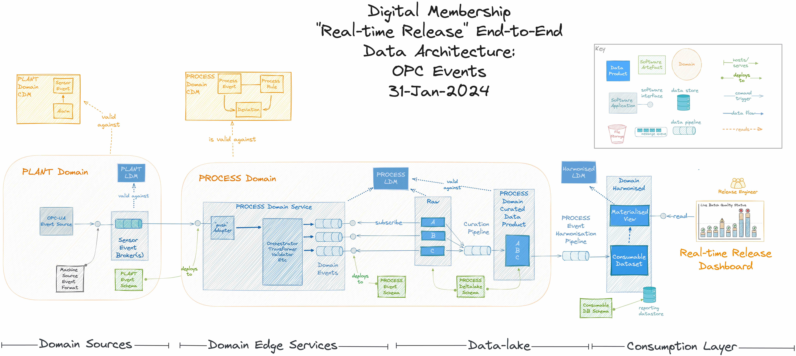

# End-to-end Data Flow of Sensor Events for the Real-time Release use-case

Here we show the end to end flow of sensor events from the source sensor on the manufacturing equipment 

| Stage=>  | Sensor | Sensor Broker | Process Broker (Edge) | Data-lake Curated (Cloud) | Data-lake Harmonisec (Cloud) |
| --------:| :------: | :------: | :------: | :------: | :------: |
| Domain    | (raw)  | PLANT  | PROCESS    |PROCESS   |(harmonised)|
| CDM       | NA     | [PLANT CDM](https://github.com/mmic-collaboration/plant-domain-model)|[PROCESS CDM](https://github.com/mmic-collaboration/process-domain-model)|[PROCESS CDM](https://github.com/mmic-collaboration/process-domain-model)|(harmonised TBD)|
| LDM       | NA    |[PLANT LDM](https://github.com/mmic-collaboration/plant-domain-model/blob/development/model/Graphics/PLANT-Domain-LDM.png)|[PROCESS LDM](https://github.com/mmic-collaboration/process-domain-model/blob/development/model/Graphics/PROCESS-Domain-LDM.png)|[PROCESS LDM](https://github.com/mmic-collaboration/process-domain-model/blob/development/model/Graphics/PROCESS-Domain-LDM.png)|(harmonised LDM TBD)|
| PDM       | TBD    | [PLANT CDM (OpenAPI)](https://github.com/mmic-collaboration/plant-domain-model/blob/development/model/OpenAPI/PLANT-Domain-OpenAPI.json)  | [PROCESS CDM (OpenAPI)](https://github.com/mmic-collaboration/process-domain-model/blob/development/model/OpenAPI/Process-Domain-OpenAPI.json)    |[PROCESS CDM (DeltaLake)](https://github.com/mmic-collaboration/process-domain-model/blob/development/model/DeltaLake/PROCESS-Domain-DeltaLake.hql)   |(harmonised)|

| Sample    | TBD    | [Alarm Codes Sample](https://github.com/mmic-collaboration/plant-domain-model/blob/development/samples/Alarms-0.3.4-Sample200124.json) | [Process Domain Payload Sample](https://github.com/mmic-collaboration/plant-domain-model/blob/development/samples/openapi-deviations-0.3.3-Sample0001.json) (TBD)    | [Deltalake Curated Deviations](https://github.com/mmic-collaboration/process-domain-model/blob/development/samples/deltalake-deviations-0.3.3-0001.csv)   |TBD|

## TO-DO
1. Get representation of raw sensor data (sensor PDM sample)
2. Get schema of the raw sensor data (if its available) 

## Code 

### Domain Model Repositories

[PLANT Domain](https://github.com/mmic-collaboration/plant-domain-model/)
[PROCESS Domain](https://github.com/mmic-collaboration/process-domain-model/)

### Architecture Repository
 - HTTPS: https://github.com/mmic-collaboration/mmic-architecture-repository.git
 - SSH: git@github.com:mmic-collaboration/mmic-architecture-repository.git